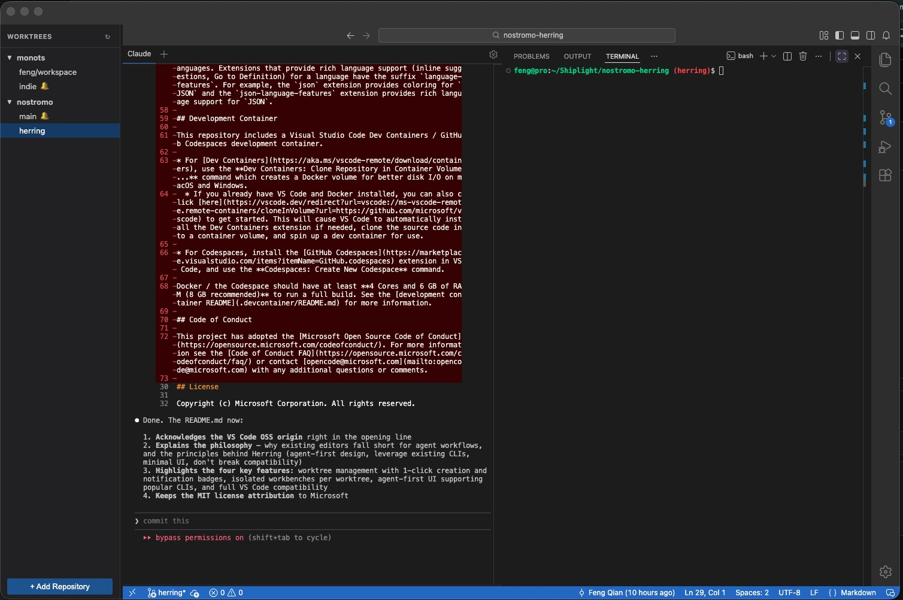

# Nostromo

  

An agent fleet management tool derived from [Visual Studio Code - OSS](https://github.com/microsoft/vscode) (v1.110.0).

## Philosophy

AI coding agents are reshaping how developers work — but the tools around them haven't caught up. Today's editors either bolt on AI as an afterthought or try to reinvent everything from scratch, locking you into a proprietary CLI and a walled garden.

Nostromo takes a different approach. We believe:

- **Dev tools should be built around the agent, not the other way around.** Agents work best when they can spin up isolated workspaces, run freely, and surface results without interrupting your flow.
- **The user stays in control.** Monitor agent work in real time, get notified when tasks complete, and inspect or review changes before they land. You manage the fleet, not the other way around.
- **Less UI, more conversation.** The default interface is stripped down to what matters: your idea, your agent, and the conversation between you and agent.
- **Don't break what works.** VS Code has a massive extension ecosystem and a workflow millions of developers rely on. Nostromo keeps all of that intact.

## Key Features

### Git Worktree Management
Create and manage git worktrees with a single click — from a local repo or by cloning from GitHub. Each worktree gets its own isolated workbench, so multiple agents can work on separate branches without stepping on each other. Notification badges let you know when an agent or terminal finishes work in another worktree.

### Isolated Workbenches
Every worktree opens as its own independent workbench (source folder). Agents, terminals, and editor state are fully isolated, giving you clean separation between parallel tasks.

### Agent-First UI
The interface is designed for conversational workflows. Popular AI CLIs are supported out of the box — bring your own agent instead of being locked into a single provider. The default layout is minimized to keep the focus on the conversation.

### Full VS Code Compatibility
All existing VS Code features, extensions, themes, and keybindings work as expected. Nostromo is a superset, not a replacement.

## Contributing

This project is entirely written by coding agents using Tachikoma (the Electron build of this project) and will **only accept changes from coding agents**.

## License

Copyright (c) Microsoft Corporation. All rights reserved.

Licensed under the [MIT](LICENSE.txt) license.
